# Pertemuan ke 16 : Praktik Aktuator: Buzzer dan Servo

## Topik Bahasan
Proyek Dasar Internet of Things I (Praktik Pemrograman Mikrokontroler, Praktik Sensor: Sensor DHT, LCD, Praktik Sensor: Ultrasonic, PIR, dan LDR, Praktik Aktuator: LED dan Relay, Praktik Aktuator: Buzzer dan Servo)

## Deskripsi
- Mampu melakukan instalasi, memahami bahasa pemrograman dan pin pada Arduino. 
- Mampu melakukan uji coba serial monitor dan uji coba PWM dengan potensiometer.
- Mampu merancang dan membuat proyek menggunakan sensor DHT22.
- Mampu merancang dan membuat proyek menggunakan sensor Ultrasonic, PIR, dan LDR.
- Mampu merancang dan membuat proyek menggunakan aktuator LED dan Relay.
- Mampu merancang dan membuat proyek menggunakan aktuator Buzzer dan Servo.

## Teori Singkat

### Pengertian Aktuator

**Aktuator** adalah sebuah peralatan mekanis untuk menggerakkan atau mengontrol sebuah mekanisme atau sistem. Aktuator diaktifkan dengan menggunakan lengan mekanis yang biasanya digerakkan oleh motor listrik. Aktuator biasanya adalah suatu output dari suatu sistem yang dikendalikan mikrokontroller.

Contoh: Motor DC, relay, solenoid valve, servo motor, stepper motor, dll.

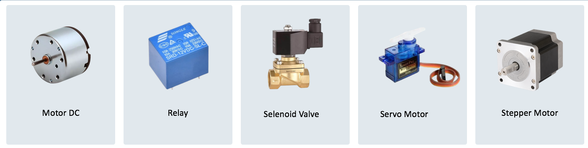

### Buzzer

**Buzzer atau Beeper** merupakan komponen elektronik yang digunakan untuk menghasilkan suara atau bip. 

Buzzer merupakan perangkat output yang mengubah sinyal listrik menjadi suara berdasarkan frekuensi yang ditentukan.

Fungsi buzzer adalah sebagai komponen yang menghasilkan output berupa bunyi beep. Kegunaan buzzer yang paling umum yaitu sebagai alarm, indikator suara, dan timer. 

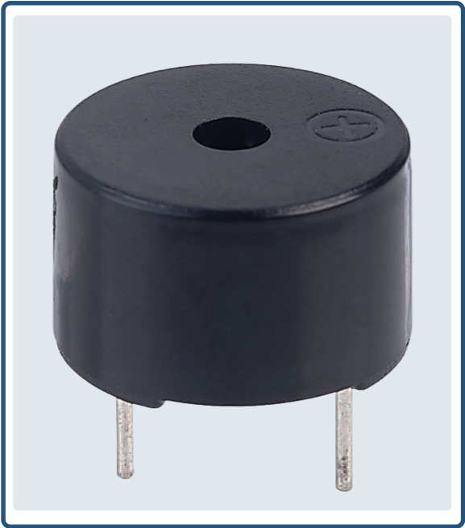

**Jenis-jenis Buzzer**

Terdapat 2 jenis buzzer, yaitu aktif dan pasif

Buzzer aktif adalah buzzer yang sudah memiliki suaranya sendiri saat diberikan tegangan listrik.
 
Buzzer pasif adalah jenis buzzer yang tidak memiliki suara sendiri sehingga perlu menentukan jenis suara yang akan digunakan.

Cara mengetes buzzer aktif atau pasif yaitu hubungkan pin + buzzer pada tegangan positif dan hubungkan pin – buzzer pada ground. Jika buzzer menyala, maka buzzer tersebut adalah buzzer aktif.

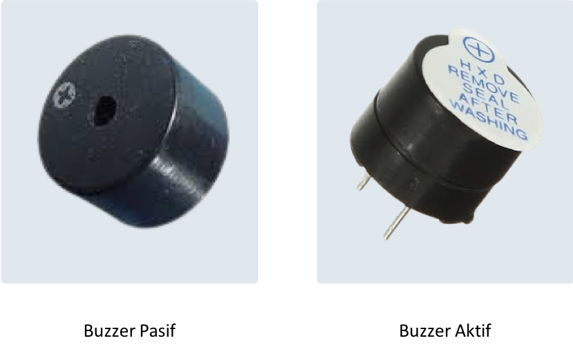

**Modul Buzzer, Skema Modul Buzzer**

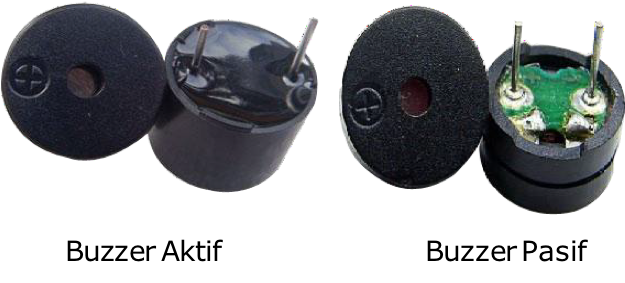
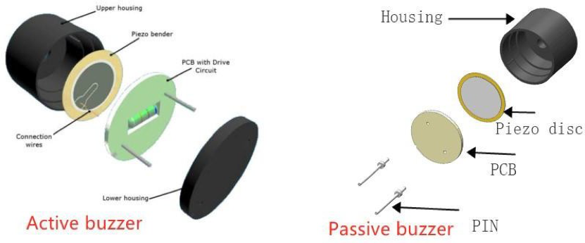
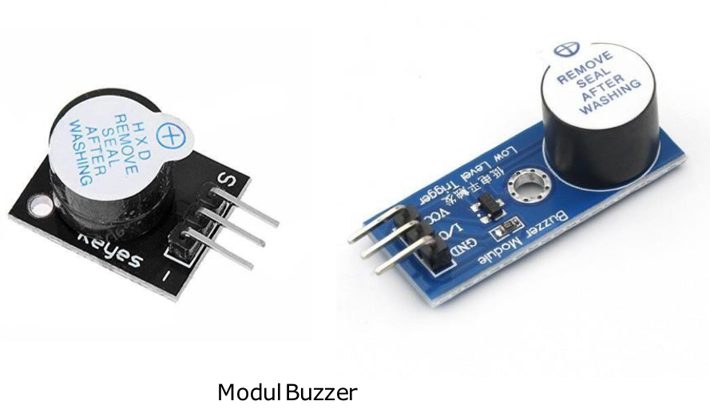
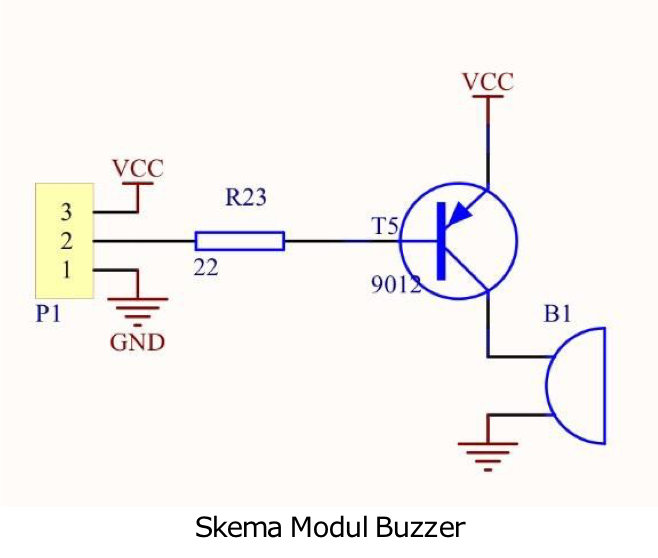

### Motor Servo

**Motor servo** adalah perangkat elektromekanis yang dirancang menggunakan sistem kontrol jenis loop tertutup (servo) sebagai penggerak dalam sebuah rangkaian yang menghasilkan torsi dan kecepatan berdasarkan arus listrik dan tegangan yang diberikan.

Motor servo bekerja dengan memutar gear dengan derajat tertentu sesuai dengan keinginan.

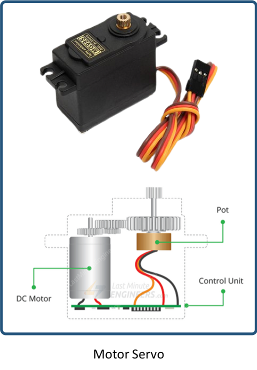

The Engineering Mindset - https://www.youtube.com/watch?v=1WnGv-DPexc

**Cara Kerja Motor Servo**

Cara kerja motor servo bergantung lebar pada sinyal modulasi yang memakai sistem kontrol. Lebar sinyal tersebut nantinya yang akan menjadi penentu bagaimana posisi dari sudut putaran yang ada pada bagian poros motor.

Motor servo biasa digunakan pada projek yang membutuhkan mekanisme gerakan mekanik dengan besar sudut tertentu.

**Contoh servo SG90**
Sesuai dengan datasheet servo SG90, untuk dapat bekerja, servo membutuhkan sinyal PWM dengan ketentuan sebagai berikut : 
-  Rotational Range: 180° 
-  Pulse Cycle: ca. 20 ms 
-  Pulse Width: 500-2400 μs 

Untuk itu, perlu dicari nilai konversi dari satuan waktu (ms) ke nilai 16 bit untuk dapat menggerakkan servo ke sudut yang diinginkan. Caranya seperti berikut ini : 
-  Time(t)=1detik=1000ms 
-  Untuk mendapatkan pulse cycle (pc) sebesar 20 ms maka dibutuhkan frekuensi (freq) 
sebesar 50 Hz, perhitungannya : pc = t / freq 
pc = 1000 / 50 pc = 20 ms

- Untuk sudut 0° membutuhkan pulse width (pw) sebesar 500 μs, maka duty cycle (dc) nya sebesar :
dc = pw / pc
dc = 500 μs / 20 ms = 500 μs / 20000 μs dc = 0.025 = 2.5%

- Untuk sudut 180° membutuhkan pulse width (pw) sebesar 2400 μs, maka duty cycle (dc) nya sebesar :
dc = pw / pc
dc = 2400 μs / 20 ms = 2400 μs / 20000 μs dc = 0.12 = 12%

- Merubah nilai duty cycle (dc) ke integer 16-bit
• Sudut 0° = duty cycle 2.5%
• Sudut 180° = duty cycle 12%
= 0.0250*65536 = 1638 = 0.1200*65536 = 7864

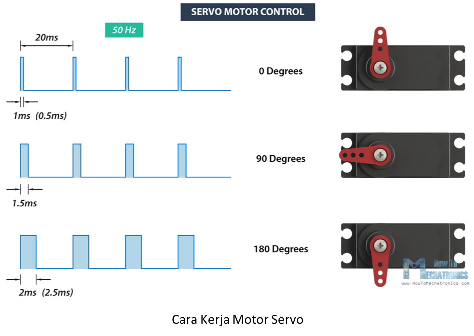

## Praktikum 1: Praktik Arduino, Buzzer

Selesaikan langkah-langkah praktikum berikut ini menggunakan Wokwi di browser Anda.

1. Masuk ke Wokwi. Klik New Projects untuk membuat projek baru. Pilih Arduino UNO.

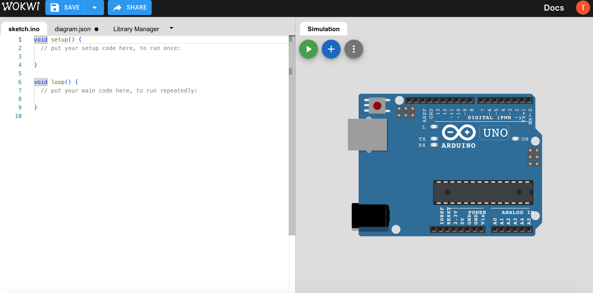 

2. Tambahkan komponen baru dengan klik Add (+). Tambahkan buzzer.

 

3. Hubungkan seluruh komponen sebagai berikut.

- + -> 7
- - -> GND

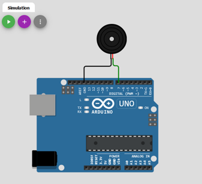 

   
4. Buatlah program seperti ditunjukan pada gambar.
Program tersebut digunakan untuk memberikan sinyal kepada buzzer agar menghasilkan suara.
Suara yang dihasilkan dapat bervariasi tergantung frekuensi yang diberikan pada program.

Klik Start Simulation untuk memulai simulasi.

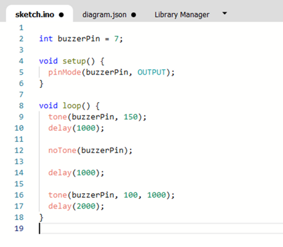 

5. Buzzer akan otomatis menyala/menghasilkan suara sesuai dengan program yang sudah dibuat.

Klik Stop Simulation untuk menghentikan simulasi

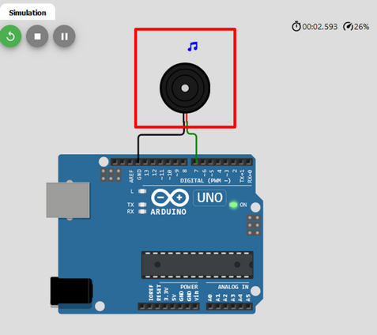 
 

## Praktikum 2: Praktik Arduino, Relay dan LED

Selesaikan langkah-langkah praktikum berikut ini menggunakan Wokwi di browser Anda.

1. Masuk ke Wokwi. Klik New Projects untuk membuat projek baru. Pilih Arduino UNO.

 

2. Tambahkan komponen baru dengan klik Add (+). Tambahkan DPDT Relay, LED, dan Slide Switch.

 

3. Hubungkan seluruh komponen sebagai berikut.

 
 

4. Buatlah program seperti ditunjukan pada gambar. Program tersebut digunakan untuk menyalakan LED melalui Relay dengan menggunakan switch. Jika Switch ON, maka lampu merah menyala, jika Switch OFF maka lampu hijau menyala. Klik Start Simulation untuk memulai simulasi.
   
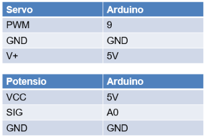 

5. Klik Switch untuk mengaktifkan dan menonaktifkan switch. Klik Stop Simulation untuk menghentikan simulasi.
+ Jika switch on, maka relay akan aktif dan lampu LED merah akan menyala.
+ Sebaliknya, jika switch off maka relay nonaktif dan LED hijau menyala.

   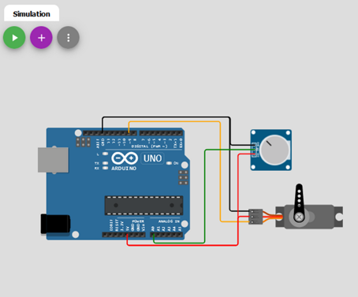

   
## Tugas Mandiri 
Selesaikan langkah-langkah praktikum berikut ini menggunakan Wokwi di browser Anda.

**Tugas 1**
1. Masuk ke Wokwi. Klik New Projects untuk membuat projek baru. Pilih Arduino UNO.

 

2. Tambahkan komponen baru dengan klik Add (+). Tambahkan Sensor PIR. Tambahkan DPDT Relay. Tambahkan LED.

 

3. Hubungkan seluruh komponen sebagai berikut.

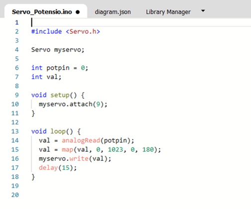 
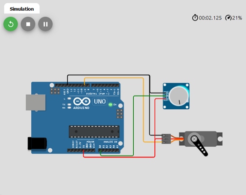 

4. Buatlah program dimana program tersebut digunakan untuk menampilkan hasil pembacaan data PIR menggunakan serial monitor. Hasil pembacaan berupa teks di Serial Monitor.

5.  Klik Sensor PIR untuk melakukan simulasi adanya gerakan di dekat sensor. Klik Stop Simulation untuk menghentikan simulasi. Relay akan menyala apabila terdapat gerakan, lalu LED akan menyala. LED akan terus menyala selama gerakan masih terdeteksi.

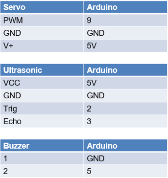 

**Tugas 2**

Berdasarkan rangkaian challenge 1, Buatlah rangkaian pada wokwi dengan menambahkan sensor HC-SR04
Tambahkan logika, ketika terdeteksi adanya objek bergerak dan jarak objek < 1 meter maka lampu LED akan menyala berkedip-kedip dan memunculkan notif “Awas Maling” di serial monitor.

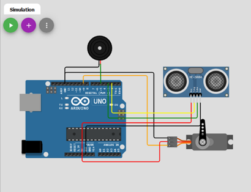 
